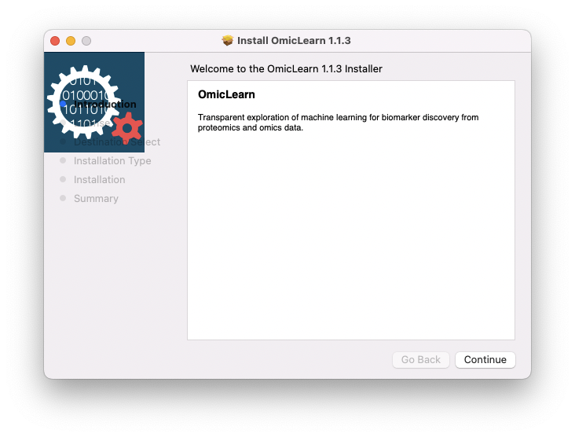
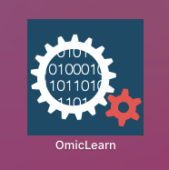
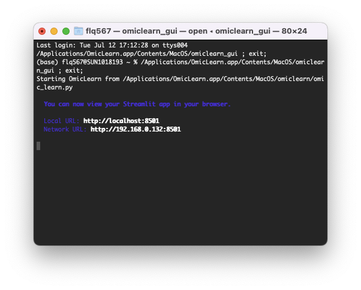
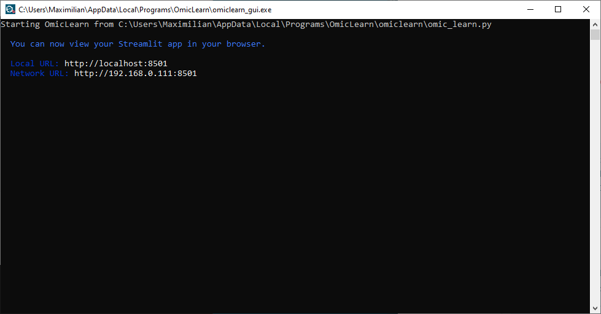

# One-Click Installation

## Mac OS
Download the latest release from the release page:
[**macOS**](https://github.com/MannLabs/OmicLearn/releases/latest/download/omiclearn_gui_installer_macos.pkg)

Right-click on the installer file and select `Open`. macOS will ask you to confirm that you want to open the app. Click `Open` on the dialog.

Note: If you don't use right-click but directly open the installer file, you will get the following error:

The OmicLearn installation wizard will appear and guide you through the installation.

On an Apple M1 Max with macOS 12.4, the installation took approximately one minute. Note that during the installation, the last step, `Registering updated components.` will take the longest. Close the installation wizard after completion of the installation. You can move the installer to the Trash after completion of the installation.

OmicLearn should now be installed on your macOS system, and you can find the application in the Applications folder, the Launchpad, or the Spotlight.

Open the application, and a terminal window will appear:

After a short time, your browser should start with the OmicLearn application. If not, type in the IP address from the terminal window into the browser of your choice:

## Linux
Download the latest release from the release page:
[**Linux**](https://github.com/MannLabs/OmicLearn/releases/latest/download/omiclearn_gui_installer_linux.deb)

## Windows
Download the latest release from the release page:
[**Windows**](https://github.com/MannLabs/OmicLearn/releases/latest/download/omiclearn_gui_installer_windows.exe)

When downloading, you might need to select that you want to keep this file. Double click on the installer, a warning from Windows will appear that it protected your PC. Click on `More info` so that the `Run anyway`-Button will appear.

The installation wizard will appear.

Select your preffered installation method and continue with the wizard. The installation on a Windows 10 Pro system with a Intel i9 took approximately one minute. Once the wizard is complete, you can select the checkbox to directly launch OmicLearn.

The Windows Defender Firewall might ask for network access:

A terminal window will appear:

After a short time, your browser should start with the OmicLearn application. If not, type in the IP address from the terminal window into the browser of your choice.
